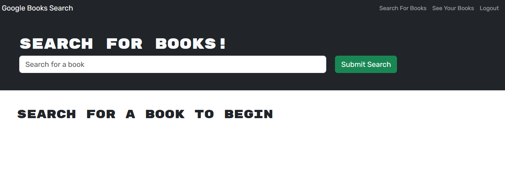

# <Your-Project-Title>

## Description

The goal of this project was to take an existing app using RESTFul API and refactor it to use GraphQL instead.

## Usage

Visit the deployed application [here](https://)

## Credits

This project is part of my studies in the KU Full Stack Web Development Bootcamp. The starter code was provided by them, and I also referenced prior course material

## License

Please see license in GitHub repo.